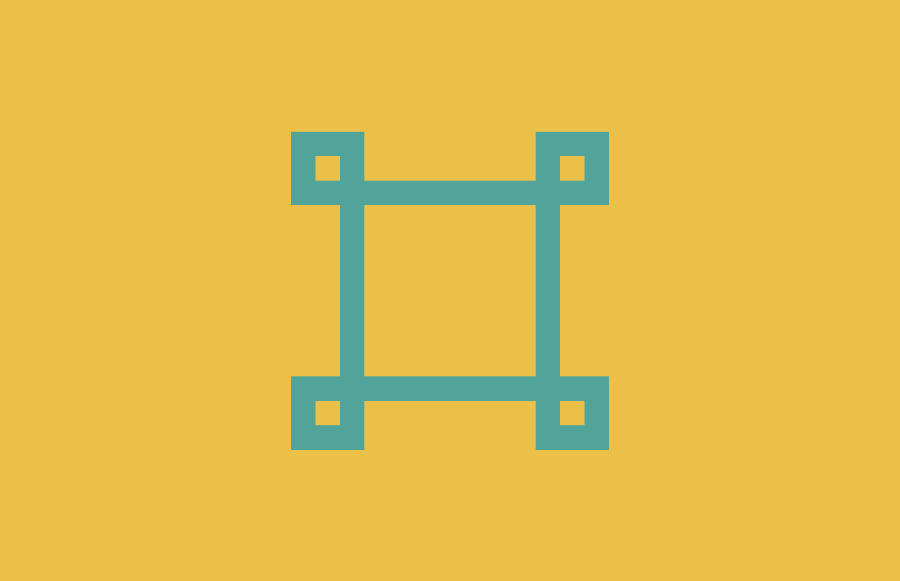

# 🎨 CSS Battle Challenge - 25 March 2025 🎯  

> A **pixel-perfect** geometric design created using **only HTML & CSS**. No JavaScript, no frameworks!  

  

---  

## 🎨 Overview  
This repository features a **minimalist geometric shape**, crafted purely using **modern CSS techniques**.  
The artwork is structured with **CSS flexbox, positioning, and transformations** to resemble a symmetrical abstract shape.  

💡 **Why Pure CSS?**  
This challenge demonstrates the power of **CSS-only** web design, showcasing how geometric shapes and real-world objects can be built without images or external dependencies.  

---  

## ✨ Features  
✅ **100% HTML & CSS** – No JavaScript required 🚀  
✅ **Pixel-Perfect Accuracy** – Matches the CSS Battle target precisely 🎯  
✅ **Fully Responsive** – Adapts smoothly to different screen sizes 📱💻  
✅ **Optimized & Lightweight** – Clean, structured, and efficient ⚡  
✅ **Customizable** – Modify colors, dimensions, and styles effortlessly 🎨  

---  

## 🛠️ Technologies Used  
- **HTML5** – Structured markup  
- **CSS3** – Utilizing **Flexbox, Grid, Positioning, and Transformations**
