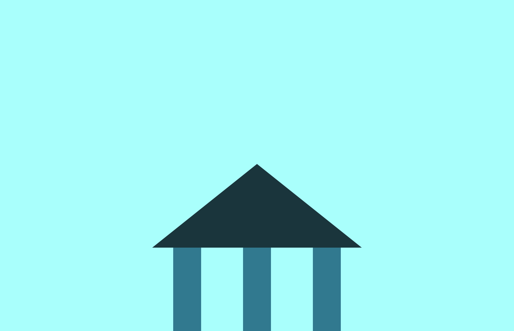

# 🎨 CSS Battle Challenge - 21 March 2025 🚀  

> A sleek, minimalistic **temple-like structure** crafted using **only HTML & CSS**—no JavaScript, no external libraries!  

  

---  

## 🌟 Overview  
This repository features a unique **temple-inspired geometric design**, built entirely with CSS.  
It’s **lightweight, responsive, and optimized**, making it ideal for web projects, branding, and creative showcases.  

💡 **Why CSS?**  
Using just HTML & CSS, we push the boundaries of web design, proving that even complex shapes can be achieved with **flexbox, Grid, clip-path, and modern CSS techniques**.  

---  

## ✨ Features  
✅ **Fully Responsive** – Adapts beautifully to all screen sizes 📱💻  
✅ **No JavaScript** – Pure HTML & CSS for blazing-fast performance ⚡  
✅ **Lightweight & Optimized** – Clean and efficient styling 🎯  
✅ **Customizable** – Easily tweak colors, shapes, and animations 🎨  

---  

## 🛠️ Technologies Used  
- **HTML5** – For structured markup  
- **CSS3** – Utilizing **Flexbox, Grid, Transformations, and Clip-path**  
