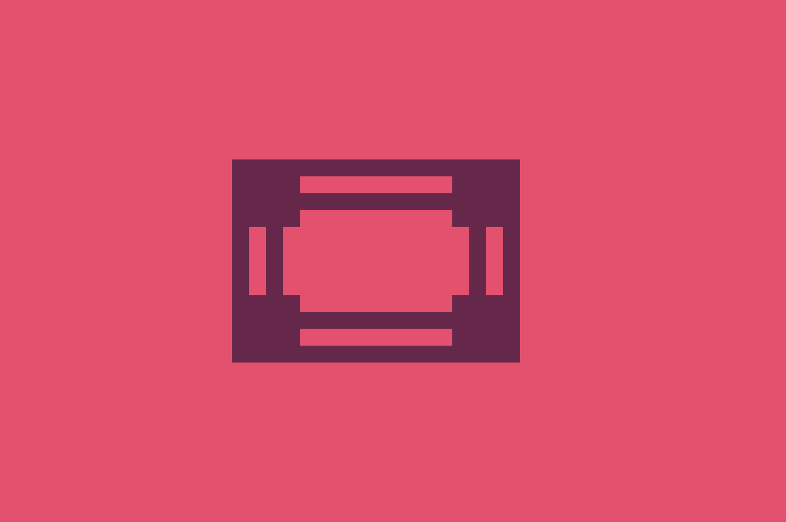

# 🖌 CSS Battle Challenge - 24 March 🎯  

> A **pixel-perfect** CSS art recreation using **only HTML & CSS**. No JavaScript, no frameworks!  

  

---  

## 🎨 Overview  
This repository showcases a unique **geometric CSS design**, crafted with precision using **modern CSS techniques**.  
The artwork is responsive, minimal, and built purely using **CSS positioning, flexbox, and transformations**.  

💡 **Why Pure CSS?**  
This project demonstrates how complex visuals can be achieved with **CSS-only** techniques, making web design more creative and performant.  

---  

## ✨ Features  
✅ **100% HTML & CSS** – No JavaScript required 🚀  
✅ **Fully Responsive** – Adapts to all screen sizes 📱💻  
✅ **Lightweight & Optimized** – Fast and efficient performance ⚡  
✅ **Customizable** – Easily tweak colors and dimensions 🎨  

---  

## 🛠️ Technologies Used  
- **HTML5** – Semantic and structured layout  
- **CSS3** – Utilizing **Flexbox, Grid, Clip-path, Transformations**  

---  

## 🚀 Setup & Usage  
1. **Clone the repository**  
   ```sh
   git clone https://github.com/tufailashraf/CSS-Battle-Challenges.git
